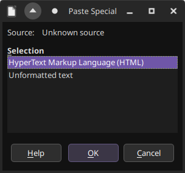
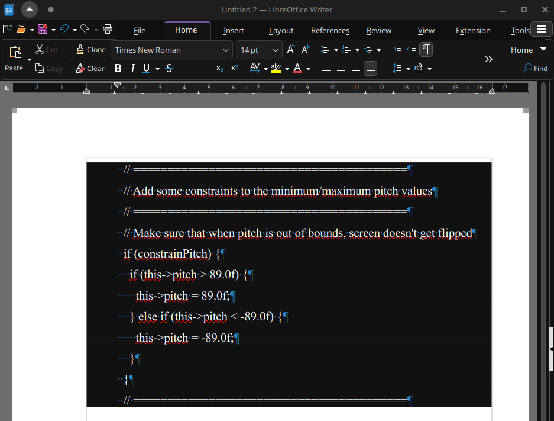
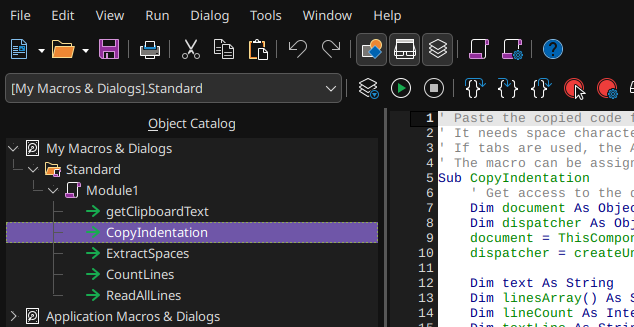
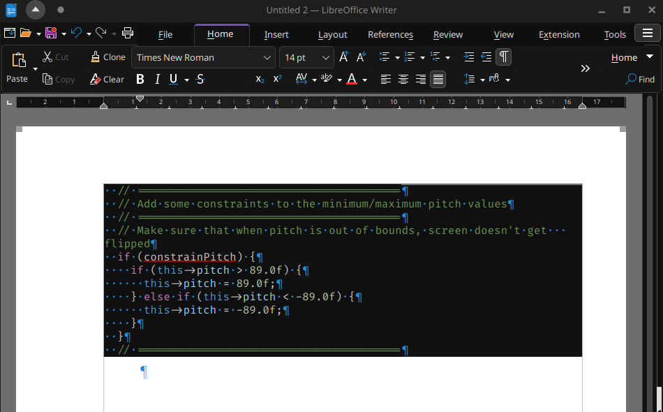

# libreoffice-paste-from-vscode

## 1. Description

This is the macros for LibreOffice to paste copied code from VS Code with preserve syntax highlighting and indents.

## 2. The problem

VS Code implemented very useful feature - preserve code formatting when copying text.
When pasting into Microsoft Word - it will keep the colors and indents of the code:

But in LibreOffice Writer situation is different - we have two choices:

- `HyperText Markup Language (HTML)`: This option will preserve colors, but not the indents:

    

- `Unformatted text`: This option will preserve indents, but not the colors:

    

(On the LibreOffice examples above, background color `Dark Grey 4` was added to the paragraphs with code)

So why this is happening and how to make pasting work properly in LibreOffice too?

## 3. Solution

At first I thought it was some LibreOffice setting. But found nothing except maybe autocorrect (`Tools` - `AutoCorrect` - `AutoCorrect Options...`):

But disabling settings about spaces did not change anything.

Next I found unanswered question [here](https://ask.libreoffice.org/t/how-can-i-keep-spaces-in-pasted-source-code-text-with-syntax-highlighting/59219/8) and then [here](https://ask.libreoffice.org/t/indentation-is-gone-when-pasting-from-vscode/54793/9). On the second post the [pawel229](https://ask.libreoffice.org/u/pawel229) user posted his solution, which became the base of my.

The solution is simple - because we have both styling and indents info in clipboard, we simply need to paste our code with style, and then insert indents for each line. The source code for the macros to do that is in file `indentation_macro_code.vb`.

## 4. Apply solution

1. Copy contents of the file [`indentation_macro_code.vb`](https://raw.githubusercontent.com/Nikolai2038/libreoffice-paste-from-vscode/refs/heads/main/indentation_macro_code.vb);
2. Open LibreOffice Writer;
3. Select `Tools` - `Macros` - `Edit Macros...`;
4. Open `My Macros & Dialog` - `Standard` - `Module1` and paste `indentation_macro_code.vb` code. Result should look like this:

    

5. Now open `Tools` - `Customize...` - `Keyboard`. Select `Keyboard` tab. Choose `LibreOffice` radio-button in the right-top corner. Now in `Category` choose `Application Macros` - `My Macros` - `Standard` - `Module1`. Select `CopyIndentation` in `Function`. Now in the `Shortcut Keys` select, for example, `Alt+V` and press Assign:

    

6. Press `OK`;
7. Now you can copy code from VS Code and paste in via pressing `Alt + V`. Result:

    

    (I had to insert 2 spaces in the first line and apply `Dark Grey 4` color to the background)

## 5. Contribution

Feel free to contribute via [pull requests](https://github.com/Nikolai2038/libreoffice-paste-from-vscode/pulls) or [issues](https://github.com/Nikolai2038/libreoffice-paste-from-vscode/issues)!
