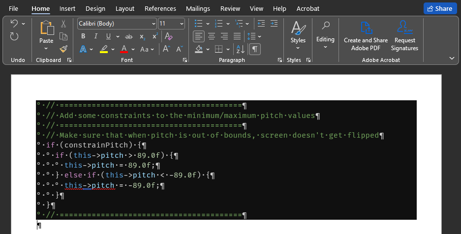

# libreoffice-paste-from-vscode

[EN](README.md) | **RU**

## 1. Описание

Это макрос для LibreOffice, который вставляет скопированный код из VS Code с сохранением и подсветки синтаксиса, и отступов.

## 2. Описание проблемы

VS Code реализовал очень удобный функционал - сохранение форматирования при копировании текста.
Если вставить его в Microsoft Word - он сохранит цвета и отступы кода:

Но при вставке в LibreOffice, ситуация отличается - у нас есть две опции:

- `HyperText Markup Language (HTML)`: Этот вариант сохранит цвета, но уберёт отступы:

    

- `Unformatted text`: Этот вариант сохранит отступы, но уберёт цвета:

    

(На скриншотах LibreOffice выше, параграфам с кодом был добавлен цвет фона `Dark Grey 4`)

Так почему это происходит и как сделать вставку более правильной и в LibreOffice?

## 3. Решение

Сначала я подумал, что за это отвечает какая-то настройка LibreOffice, но ничего не нашёл, кроме настройки автокорректирования (`Tools` - `AutoCorrect` - `AutoCorrect Options...`):

Отключение опций по удалению пробелов ничего не изменило.

Затем я нашёл неотвеченный вопрос тут [тут](https://ask.libreoffice.org/t/how-can-i-keep-spaces-in-pasted-source-code-text-with-syntax-highlighting/59219/8) а затем [тут](https://ask.libreoffice.org/t/indentation-is-gone-when-pasting-from-vscode/54793/9). Во втором посте пользователь [pawel229](https://ask.libreoffice.org/u/pawel229) предложил решение, которое стало основой для моего.

Решение простое - так как мы имеем и форматирование, и отступы в буфере обмена, нам нужно просто вставить наш код с форматированием, а затем вставить отступы для каждой строки. Исходный код для макроса, который это всё сделает, расположен в `indentation_macro_code.vb`.

## 4. Установка и использование

Нужно:

1. Скопировать содержимое файла [`indentation_macro_code.vb`](https://raw.githubusercontent.com/Nikolai2038/libreoffice-paste-from-vscode/refs/heads/main/indentation_macro_code.vb);
2. Открыть LibreOffice Writer;
3. Выбрать `Tools` - `Macros` - `Edit Macros...`;
4. Зайти в `My Macros & Dialog` - `Standard` - `Module1` и вставить код из файла `indentation_macro_code.vb`. Результат будет выглядеть так:

    

5. Теперь открыть `Tools` - `Customize...` - `Keyboard`. Выбрать вкладку `Keyboard`. Выбрать радио-кнопку `LibreOffice` в правом верхнем углу. Теперь в `Category` выбрать `Application Macros` - `My Macros` - `Standard` - `Module1`. Выбрать `CopyIndentation` в `Function`. Теперь в `Shortcut Keys` выбрать, например, `Alt+V` и нажать `Assign`:

    

6. Нажать `OK`;
7. Теперь скопировать какой-нибудь код из VS Code и вставить его в документ при помощи сочетания клавиш `Alt + V`. Результат:

    

    (Мне пришлось добавить два пробела в начале первой строчки и применить цвет фона `Dark Grey 4` для параграфов)

## 5. Развитие

Не стесняйтесь участвовать в развитии репозитория, используя [pull requests](https://github.com/Nikolai2038/libreoffice-paste-from-vscode/pulls) или [issues](https://github.com/Nikolai2038/libreoffice-paste-from-vscode/issues)!
